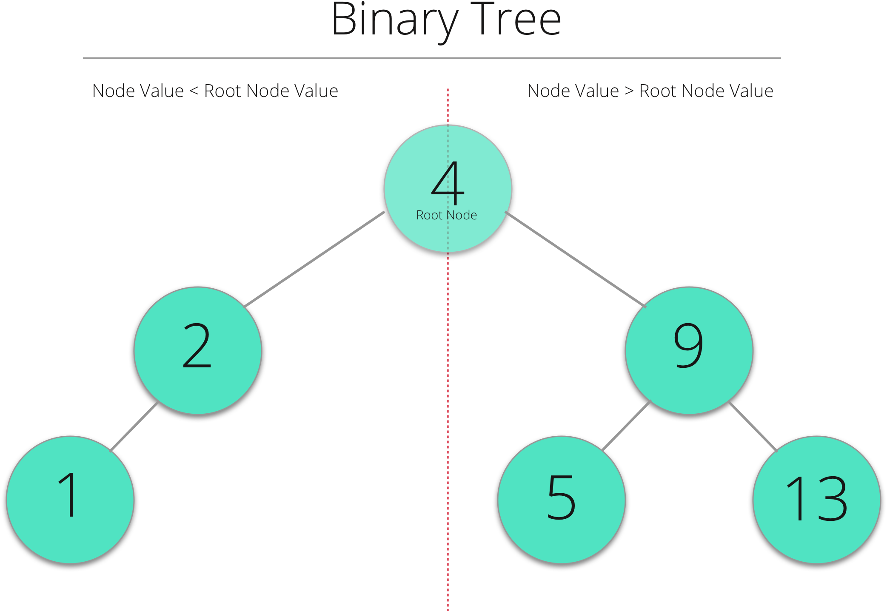

## Building a Binary Search Tree in Swift 3

@(GTD - Inbox)[Marxico, Manual, Markdown, #blog]

###Binary Tree
A binary search tree is a basic data structure that is used to organize and retrieve data.
Here is an illustration of a binary tree.



### Properties of Binary Trees
- Nodes at left have lower values.
- Nodes at the right have higher values.
- 

### Node
The building block of a binary tree is a node. Typically many nodes combine together to form a binary tree.  Each node has a maximum of two child nodes and only one parent node (Except the root node). The root node does not have a parent node.


Lets take a closer look at a node.


### Operations on a Binary Tree 
- **Insert** : Adding new nodes to a binary tree.
- **Find** : Primary purpose of binary trees is to quickly look up values.
- **Traverse** : List out all the nodes of a tree.
- **Delete** : Delete nodes in a tree.

----------
### Use of Binary Tree
Consider the scenario below, we have a a list of players from a football team and their respective Jersey numbers. 
If we were to write a program that will take a jersey number as input and print out the players name.
We would need some kind of data structure where we store the information, below. We can then look up the jersery number against the table.

We could use different types of data structures like Array, Hash Tables (Dictionary) etc, however, in this post we will use a Binary tree.

To look up values in a binary tree takes O log(n) time.. <Prashanth> explain this further.

| Jersey #  | Player Name |    
| :-------- | :--------|
|44|	Asiata, Matt|
|55|	Barr, Anthony|
|64|	Beavers, Willie|
|61|	Berger, Joe|
|8|		Bradford, Sam|
|40|	Brothers, Kentrell|
|68|	Clemmings, T.J.|
|57|	Cole, Audie|
|14|	Diggs, Stefon|
|6|	Heinicke, Taylor|
|69|	Hill, Rashod|

Approach :
- Create multiple a Binary tree node to represent one player.
- The key used to insert players into the node will be the jersey number.
- Each node will store information relevant to that player #, Here Player name.

### Create a Node

``` swift
// ========================= BTNode ========================= //

class BTNode {

var key : Int = -1                // Player Jersery #
var value : String = ""           // Player Name

var leftChildNode : BTNode? = nil
var rightChildNode : BTNode? = nil
var parentNode : BTNode? = nil

private init() {}

convenience init(key: Int, value : String) {
self.init()
self.key = key
self.value = value
}
}
```

Now that we have a node defined, we can create an instance of a `BTNode` that represent a player like so.

``` swift
//: Create instance of BTNode

let playerNode1 = BTNode(key : 44, value : "Asiata, Matt")

print(playerNode1.key)         // Output : 44
print(playerNode1.value)       // Output : "Asiata, Matt"
```


Further on, we will need to check if a node has any child nodes, so lets refine the `BTNode ` class further by adding some computed properties.

```swift
// Helper Method

// Checks if the node has a left child node.
var hasLeftNode : Bool{
return leftChildNode != nil
}

// Checks if the node has a right child node.
var hasRightNode : Bool{
return rightChildNode != nil
}
```
---------

### Building the tree

The `BTNode` by itself is not useful. We now need to build a tree using multiple nodes.

``` swift
// ====================== Binary Tree ====================== //
class BTree{
var rootNode : BTNode?
var treeHeight : Int = 0
}
```

The BTree class above represents a binary tree, the tree has a two stored properties.  
1. Reference to its root node. i.e the node at the top of the tree.
2. treeHeight property, that tracks the number of nodes in the tree.

### Helper Methods

While inserting nodes in a Binary Tree, we frequently link nodes together by setting a leftChildNode, rightChildNode and parentNode properties. Here we add some helper methods.

```swift
func setLeftNode(_ leftNode : BTNode, parentNode : BTNode) {
parentNode.leftChildNode = leftNode
leftNode.parentNode = parentNode
}

func setRightNode(_ rightNode : BTNode, parentNode : BTNode) {
parentNode.rightChildNode = rightNode
rightNode.parentNode = parentNode
}

func setRootNode(_ node : BTNode){
rootNode = node
rootNode?.parentNode = nil
rootNode?.leftChildNode = nil
rootNode?.rightChildNode = nil
}
```

------
###Inserting nodes into the Tree
Lets now add the ability to insert nodes into a tree.
The logic to add a node (nodeA) is :

- Check if the tree is Empty, if yes add the nodeA as the root node.
- If root node already exists
- If nodeA key < root node key :
- Shift towards the left of the tree.
- Look for node that has no child node and insert nodeA
- If nodeA key > root node key : 
- Shift towards the right of the tree & look for an empty node.
- Look for node that has no child node and insert nodeA

``` swift
func insertNode(inputNode : BTNode, currentWorkNode : BTNode? = nil) {

// Empty Tree -> Insert as Root.
if rootNode == nil {
setRootNode(inputNode)
return
}

let tempWorkNode = currentWorkNode ?? rootNode!

// If inputNode < CWC.key Shift Left
if inputNode.key < tempWorkNode.key {
if tempWorkNode.hasLeftNode {
//Keep looking further to the left of current node.
return insertNode(inputNode: inputNode, currentWorkNode: tempWorkNode.leftChildNode!)
}

// If we have a node with no left leaf. Insert here.
setLeftNode(inputNode, parentNode: tempWorkNode)
return
}

// If inputNode > CWC.key Shift Right
if inputNode.key > tempWorkNode.key {
if tempWorkNode.hasRightNode {
// Keep looking further to the right of current node.
return insertNode(inputNode: inputNode, currentWorkNode: tempWorkNode.rightChildNode!)
}

// If we have a node with no right leaf. Insert here.
setRightNode(inputNode, parentNode: tempWorkNode)
return
}
return
}

```
-----

### Lets insert some nodes !

```
//: Build the tree.
let playerBTree = BTree()

// Add some players to the tree
playerBTree.insertNode(inputNode: BTNode(key: 44, value: "Asiata, Matt"))
playerBTree.insertNode(inputNode: BTNode(key: 55, value: "Barr, Anthony"))
playerBTree.insertNode(inputNode: BTNode(key: 64, value: "Beavers, Willie"))
playerBTree.insertNode(inputNode: BTNode(key: 61, value: "Berger, Joe"))
playerBTree.insertNode(inputNode: BTNode(key: 8, value: "Bradford, Sam"))
playerBTree.insertNode(inputNode: BTNode(key: 40, value: "Brothers, Kentrell"))
playerBTree.insertNode(inputNode: BTNode(key: 68, value: "Clemmings, T.J."))
playerBTree.insertNode(inputNode: BTNode(key: 57, value: "Cole, Audie"))
playerBTree.insertNode(inputNode: BTNode(key: 14, value: "Diggs, Stefon"))
playerBTree.insertNode(inputNode: BTNode(key: 2, value: "Forbath, Kai"))
playerBTree.insertNode(inputNode: BTNode(key: 6, value: "Heinicke, Taylor"))
playerBTree.insertNode(inputNode: BTNode(key: 69, value: "Hill, Rashod"))
```

### Output 

After the insert we expect our tree to look like this. It is difficult to visualize what the generated tree looks like. The code below enables each node to print out its structure. 


Make the `BTNode` adopt to the `CustomStringConvertible` protocol.

```swift
class BTNode:CustomStringConvertible {
............
}
```
Implement the description property that returns a string representation of any node.

```swift
var description: String {
return "\n\t\t\(self.key) \n\t ⋰  ⋱  \n   \(leftChildNode?.key ?? -1) \t  \(rightChildNode?.key ?? -1)"
}
```

```swift
//MARK: Searching
func find(_ value : Int) -> BTNode? {
if rootNode == nil {return nil}
return lookUp(value)
}

private func lookUp(_ value : Int, startingNode : BTNode? = nil) -> BTNode? {

let tempWorkNode = startingNode ?? rootNode!        
if tempWorkNode.value == value{return tempWorkNode}

if tempWorkNode.value < value {
if tempWorkNode.hasRightNode{
return lookUp(value, startingNode: tempWorkNode.rightChildNode)
}
return nil
}

if tempWorkNode.value > value {
if tempWorkNode.hasLeftNode{
return lookUp(value, startingNode: tempWorkNode.leftChildNode)
}
return nil
}        
return nil
}
```

### Output

```swift
// Search for a key present in the tree.

let resultNode = playerBTree.find(14)
print(resultNode ?? "Node Not found")
/* ==================
14 
⋰  ⋱  
-1 	  -1   
--------------------- 
Diggs, Stefon 
⋰    ⋱ 
nil 	   nil 
===================== */
```


```swift
let badNode = playerBTree.find(99)
print(badNode ?? "Node Not found")

/* Output : Node Not found */
```


### Conclusion
This post discussed how to create a binary tree, insert nodes and find a node in the tree. For most use cases, binary trees are used to quickly search and find data elements.

### Playground File.
You can download the complete playground here.

### What Next?
This tree we build is very limited, it only works when they key is of type `Int` and value is of type `String`.

For our `BTNode` and `BTree` to be useful, we need them to accept any valid type (with some restrictions ofcourse!) as key and value.

In the next post, We build a generic version of Binary Tree and also add more functions. i.e traverse a tree and deleting nodes.

-----------

-> Building a generic version of our BST

-> A real world example of a BST.

-> Conclusion.


------

Why you a BST over a hash table.
http://stackoverflow.com/questions/4128546/advantages-of-binary-search-trees-over-hash-tables
http://stackoverflow.com/questions/38529646/swift-why-the-customstringconvertible-description-is-run-too-many-times-in-this
